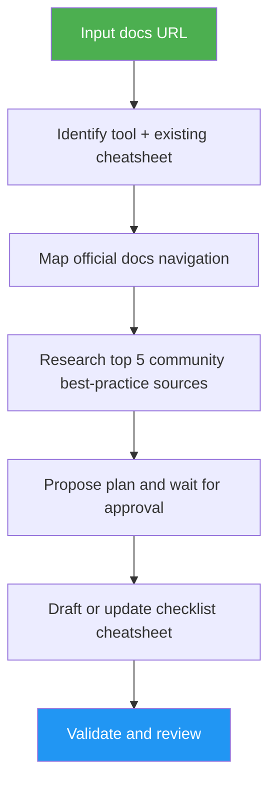

<!--
  DO NOT READ THIS FILE — This README.md is for human catalog browsing only.
  It ships inside the .skill package but is NEVER auto-loaded into agent context.
  The runtime loader only reads SKILL.md + references/ + scripts/ + agents/ when the skill triggers.
  If you're an AI agent, read the SKILL.md file instead for skill instructions.
-->

# Docs to Cheatsheet

> Turn an official tool documentation link into a concise, source-backed, checklist-style cheatsheet.

## Highlights

- Identifies the tool, slug, docs root, and existing cheatsheet status.
- Maps documentation navigation before drafting, so coverage is intentional.
- Pulls in top recent/community best-practice sources without letting blogs override official command syntax.
- Requires a plan approval step before writing or updating files.
- Produces checkable Markdown from installation through advanced optimization.

## When to Use

| Say this... | Skill will... |
| ----------- | ------------- |
| "Create a cheatsheet from this docs page: https://..." | Map docs, plan coverage, then generate a checklist cheatsheet after approval. |
| "Update the Codex cheatsheet from the official docs" | Detect the existing cheatsheet and propose an update plan. |
| "Turn these tool docs into a short setup checklist" | Extract installation, config, commands, best practices, and references. |
| "Make a concise advanced setup cheat sheet" | Organize basic-to-advanced steps with source-backed recommendations. |

## How It Works



## Usage

```text
/docs-to-cheatsheet https://docs.example.com/tool/get-started
```

## Resources

| Path | Description |
| ---- | ----------- |
| `agents/docs-mapper.md` | Maps official docs navigation and page coverage. |
| `agents/community-researcher.md` | Finds top recent/popular practical best-practice sources. |
| `agents/cheatsheet-reviewer.md` | Reviews the final cheatsheet for style, source support, and validation readiness. |
| `evals/evals.json` | Example prompts for testing skill behavior. |

## Output

A Markdown cheatsheet under `src/content/cheatsheets/<slug>/<slug>.md`, using checklist items, repository frontmatter, source references, and validation results.
