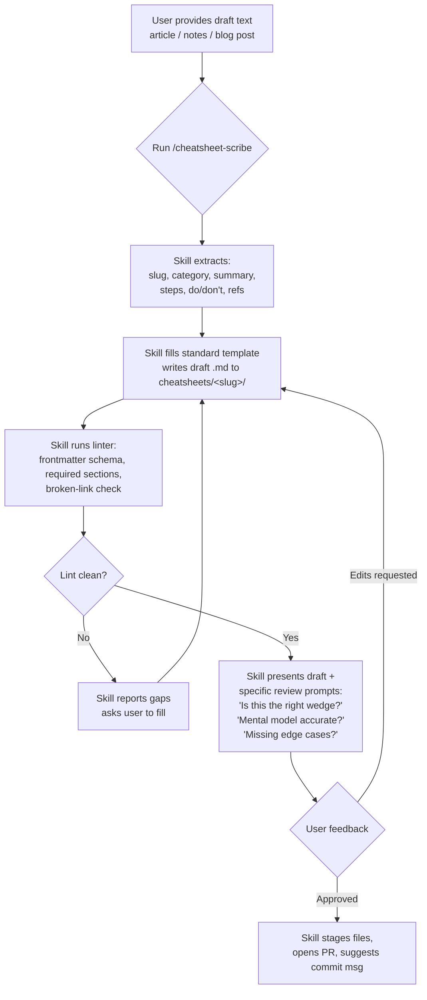

# Idea: Awesome AI Cheatsheets

## Original Concept

An open-source catalog of cheatsheets focused on installing, using, and optimizing
popular AI tools — plus AI concept primers (agent skills, MCP, sub-agents).

**Goal:** one trusted place to quickly *skim* a reference or get a clear *overview*
of an AI tool/concept.

### Catalog page
- Latest / most-popular tools surfaced first
- Search, filter, sort by multiple criteria

### Per-cheatsheet requirements
- HTML format, interactive, rich visualization (SVG + Mermaid diagrams/charts)
- PDF-exportable
- Visible "last updated" date (age of content visible at a glance)
- Reference section (collapsed by default, links to upstream source)
- Best-practices section (do/don't, when to use / when not to)
- For tool cheatsheets: step-by-step setup, usage, optimization — all copy-paste-friendly
- Responsive by default
- Compact but clean visual design; surface what matters most

### Technical constraints
- Static, pre-rendered, serverless
- Hosted on GitHub Pages
- Tailwind CSS + shadcn/ui aesthetic
- Self-hosted assets (no CDN dependencies — content shouldn't break if a CDN dies)
- Automatic deployment (CI/CD on push)

## Clarified Understanding

### Audience
Primary: developers adopting AI tools (Claude Code, Cursor, MCP servers, sub-agents,
agent SDKs) who need a fast reference under deadline pressure. Secondary: AI-curious
learners and AI power-users — but the writing voice and depth lead with the developer.

### Core differentiation
**Curation.** Knowledge about AI tools is scattered across Twitter, Discord,
GitHub READMEs, and stale blog posts. The bet is that a single curated catalog
with a *visible quality bar* — and visible recency — beats search.

### Success in 6-12 months
A community hub. ~10-30 active contributors, 100+ cheatsheets, ~1k GitHub stars.
Sustainability via OSS community, not a solo grind.

### Quality control model
Template + linter + automated checks. Strict frontmatter schema, required sections,
broken-link checks, "last-updated" age warnings. CI gates PRs before review.

## Target Audience

Tier 1 (writing voice optimized for):
- Software engineers integrating Claude Code, Cursor, Cline, Aider, etc.
- Developers building with MCP servers and sub-agent patterns
- AI-tooling early adopters who need to *compare and choose*

Tier 2 (welcome but not primary):
- AI-curious learners scanning the landscape
- AI power-users hunting obscure optimization tricks

## Goals & Objectives

- Become the go-to "I want to learn / refresh on X AI tool" destination
- Maintain a visible freshness bar (no stale content)
- Build a healthy contributor community via clear template + automated checks
- Stay 100% static / zero-cost to host (GitHub Pages + CI)

## Launch Content List (locked)

### Tools (6)
1. **Hermes Agent** — NousResearch's self-improving AI agent with built-in learning loop, autonomous skills, multi-channel gateway (Telegram/Discord/Slack/etc).
2. **OpenClaw** — 68k★ open-source personal AI assistant by Peter Steinberger; runs locally, model-agnostic, 100+ AgentSkills, 20+ chat platform integrations.
3. **Pi (Pi Coding Agent)** — Terminal-based coding agent, minimal-by-default (4 tools out-of-the-box), TypeScript-extensible, sub-agents + MCP + plan mode.
4. **Claude Code** — Anthropic's CLI; the de-facto reference for harness engineering since the March 2026 source leak.
5. **Codex CLI** — OpenAI's Rust-based terminal agent (~75k★, 14.5M monthly npm dl, 3M WAU).
6. **OpenCode** — 160k★ Go-based open-source CLI coding agent with 75+ provider support, LSP, SQLite session storage, vim-like editor.

### Concepts (5)
1. **Agent Skills** — reusable prompts + bundled artifacts (scripts, references) for AI agents.
2. **Sub-agents** — isolated agents exposed as tools; "who does it" layer.
3. **MCP (Model Context Protocol)** — open standard for AI ↔ external system connectivity ("USB-C for AI").
4. **Harness Engineering** — designing the agent loop, tool dispatch, memory/permissions/observability *around* the model (Memory + Tools + Permissions + Hooks + Observability).
5. **Prompt Engineering** — patterns and techniques for effective LLM instruction.

### Why this list works as a v1
- Spans **3 tiers of incumbent coverage**: well-documented (Claude Code, Codex), well-known but under-documented in rich format (OpenCode, OpenClaw, Pi), under-documented period (Hermes Agent).
- Concepts complement the tools — readers can land on a tool cheatsheet, click "Agent Skills" or "Harness Engineering" to get the mental model.
- 11 cheatsheets ≈ a credible catalog without overshooting weekend bandwidth.
- "Harness engineering" specifically is a hot 2026 topic post-Anthropic-leak with very few rich-format references — likely the strongest discovery hook.

## Authoring Workflow: `cheatsheet-scribe` Skill (day-0 decision)

We ship a **Claude Code agent skill** alongside the catalog — `cheatsheet-scribe` — that
converts raw draft text into a standard-format cheatsheet, then iterates with the author
until merge-ready. This is a deliberate day-0 investment, not a future enhancement.

### Why day 0
The Hermes Agent PoC already demonstrated the cost: writing a single cheatsheet that
exercises the full template contract (frontmatter, Mermaid diagram, 8-step flow, do/don't,
comparison matrix, command table, collapsed references) takes meaningful time. Multiplying
that across 11 cheatsheets *and* an open contributor pipeline is the single biggest risk
to the project. The scribe skill collapses that cost from hours to a guided ~15–30 min
session — for you and for every external contributor.

### Where the skill lives
- **In this repo** under `.claude/skills/cheatsheet-scribe/SKILL.md` (+ supporting files).
- Versioned with the catalog so contributors clone once and get the authoring tool *plus*
  the validator *plus* the lint rules. Single source of truth.

### Workflow (input → output)

### Skill contract (locked at v1)

The scribe MUST:
1. **Parse the draft** for: tool/concept name, category (tool vs concept), explicit
   step-by-step content, do/don't lists, references, and any sample commands.
2. **Fill the template** at `cheatsheets/<slug>/<slug>.md` with all required sections
   from the v1 template contract (see Hermes Agent PoC as canonical).
3. **Auto-generate** the Mermaid mental-model diagram from the draft's structure, or
   ask one targeted question if the draft doesn't imply one.
4. **Run the validator** (frontmatter schema + required-sections + broken-link CI rules
   running locally) and surface failures *before* asking for review.
5. **Iterate explicitly**, not silently: after each pass, ask 2–4 specific review
   questions (not "looks good?") — e.g., "Is the wedge framed correctly given existing
   coverage?", "Is the comparison matrix comparing the right alternatives?".
6. **Stop when the linter is clean *and* the user explicitly approves** — never auto-merge.
7. **Suggest, never write,** the commit message and PR title; the human owns the merge.

The scribe MUST NOT:
- Fabricate references or commands not present in the draft.
- Overwrite an existing cheatsheet without explicit confirmation.
- Run any destructive git operations.
- Add content beyond what the draft + clarifying answers support.

### How this changes the project shape
- **Authoring cost per cheatsheet drops materially** — the bottleneck moves from
  "writing 350 lines of structured markdown" to "providing a good draft + reviewing".
- **Contributor barrier collapses.** Outsiders don't need to memorize the template
  contract; they paste a draft and the skill handles structure. The MDX vs MD friction
  we worried about in `validate.md` largely disappears because the scribe outputs the
  correct format.
- **Quality bar is enforceable from PR #1** — the same lint rules the scribe runs
  pre-submit also run in CI. No "I'll fix the format later" loophole.
- **The skill becomes a discovery hook in its own right.** A working Claude Code skill
  that converts notes → publishable cheatsheets is showcaseable — and lives naturally
  inside the catalog (which has a cheatsheet *for* the agent-skills concept). Nice
  recursion.

### Day-0 ordering (revises the implementation roadmap in `validate.md`)
1. **Phase 0a (weekend 1):** Lock the v1 template *contract* from the Hermes PoC.
   Write the frontmatter schema (Zod or JSON Schema) + a CLI linter.
2. **Phase 0b (weekend 2):** Author the `cheatsheet-scribe` skill against that contract.
   Acceptance test: skill regenerates the Hermes cheatsheet from a stripped-down draft
   and produces output that lints clean and is ~equivalent in structure.
3. **Phase 0c (weekends 3–4):** Astro/MDX site + auto-deploy + freshness UX.
4. **Phase 1+:** Use the skill to author the next cheatsheets. Hermes Agent stays
   PoC #1 as the proof the skill's output meets the bar.

This re-ordering matters: **skill before content**. Authoring cheatsheets 2–11 manually
when a working scribe is two weekends away would burn the budget the project doesn't have.

## Technical Context

- **Stack:** Astro (MD/MDX content, zero-JS default, Tailwind + shadcn-style components)
- **Authoring:** MDX (markdown + embeddable React components for interactive bits)
- **Styling:** Tailwind CSS + shadcn/ui
- **Diagrams:** Mermaid (static rendered at build) + inline SVG
- **PDF export:** client-side print stylesheet (no server)
- **Hosting:** GitHub Pages, static output, no CDN dependencies — all assets self-hosted
- **Deployment:** GitHub Actions on push to `main`
- **Search/filter:** client-side (e.g., Pagefind or Fuse.js) — no backend
- **Timeline:** Side project, ~5-10 hrs/week. MVP target: 4-8 weeks.
- **Launch content:** 10-15 cheatsheets (credible catalog day 1)
- **Budget:** Bootstrapped / free tier only

### Constraints
- No CDN dependencies — pin and vendor everything
- No server, no database — everything pre-rendered at build
- Templates and linters must be in place *before* opening to contributors
- Author bandwidth is the bottleneck — automation matters more than features

## Discussion Notes

- The "curation, not just collection" framing is the most defensible angle —
  competitors in this space are mostly link-list "awesome-*" repos which
  decay quickly and have no quality signal.
- Freshness as a UX-first concept (visible age, warnings on stale entries)
  could be the single most differentiating feature.
- Risk: opening to contributors *before* template/linter is mature → quality
  collapse. Build the rails first.
- Risk: "all three audiences" can dilute voice — keep developer as default
  reader, treat the other two as readers who get value from a clearly-written
  dev resource.
