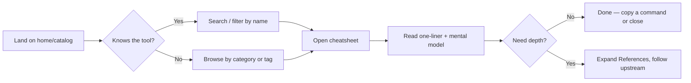
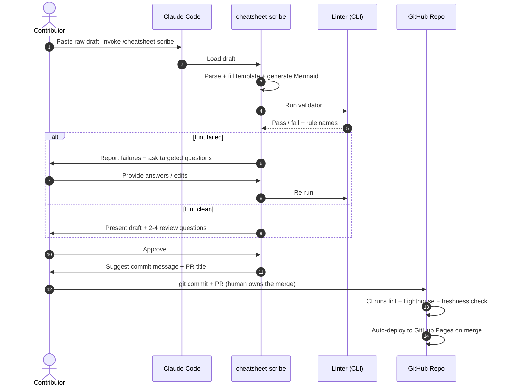
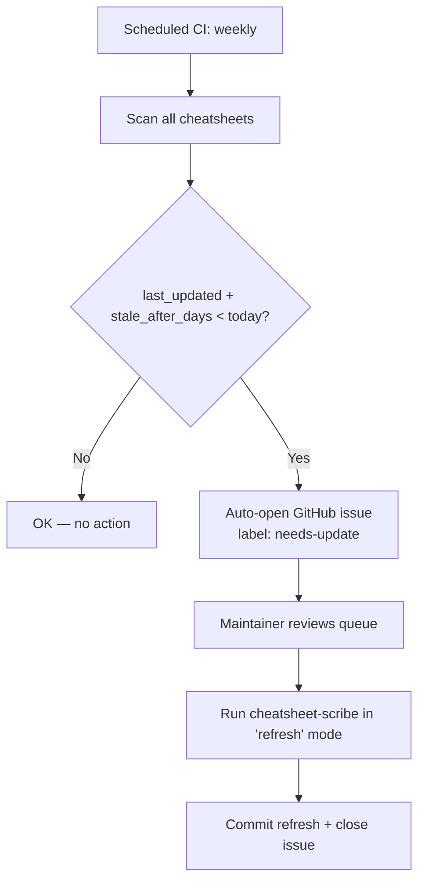
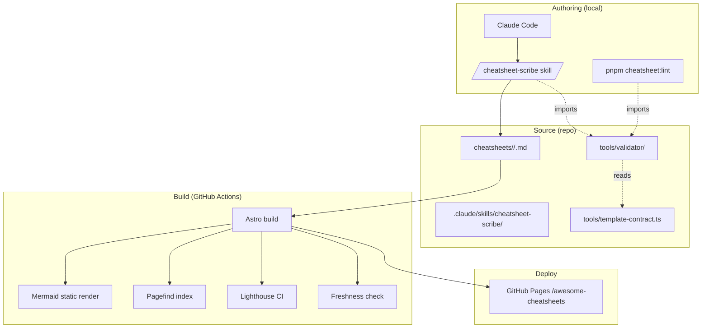

# PRD — awesome-cheatsheets

**Source:** `idea.md`, `validate.md` (this directory)
**Status:** v1.0 — initial PRD
**Date:** 2026-05-18
**Owner:** luongnv89

---

## 1. Product Overview

### Vision
> An open-source catalog of cheatsheets focused on installing, using, and optimizing
> popular AI tools — plus AI concept primers (agent skills, MCP, sub-agents). One
> trusted place to quickly *skim* a reference or get a clear *overview* of an AI tool
> or concept.
> — Source: `idea.md`

### What it actually is (refined post-validation)
Per `validate.md`, the defensible wedge is **format + freshness + comparability**,
not "another curated hub" (the 36.8k★ `hesreallyhim/awesome-claude-code` owns that
lane). `awesome-cheatsheets` ships rich-format, visibly-dated, PDF-exportable,
mutually-comparable references for a focused slice of the AI tooling stack —
terminal-native AI coding agents and the concepts behind them — and includes a
day-0 Claude Code skill (`cheatsheet-scribe`) that authors them.

### Users (summary; full personas in §2)
- **Primary (Tier 1):** developers adopting AI coding tools (Claude Code, Codex,
  OpenCode, Pi, Hermes Agent, OpenClaw) who need a fast reference under deadline pressure.
- **Secondary (Tier 2):** AI-curious learners and AI power-users hunting optimizations.

### Goals & Objectives
1. Ship a credible v1 catalog of **11 cheatsheets** (6 tools + 5 concepts) in 8 weekends.
2. Ship the **`cheatsheet-scribe` skill** day-0 to collapse per-cheatsheet authoring
   cost from hours → ~15–30 min and make the contributor on-ramp trivial.
3. Make **freshness** a first-class UX element — visible last-updated date and stale
   warning past the threshold.
4. Stay 100% static, serverless, zero-cost to host (GitHub Pages + Actions).

### Non-goals (v1)
- A general-purpose "all AI tools + all AI knowledge" catalog. Scope is locked to
  terminal-native coding agents + the harness/skills/MCP concept layer.
- A community platform with accounts/comments/upvotes. Contribution = GitHub PR.
- Vendor-supported integrations or any paid tier.
- Mobile-first interaction patterns. Responsive yes; mobile-app feel no.

### Success Metrics (90 days post-launch)

| Metric                                  | Target                     | Source / Method                   |
|-----------------------------------------|----------------------------|-----------------------------------|
| Cheatsheets published                   | ≥ 11 within 60 days        | `git log` on `cheatsheets/*`      |
| GitHub stars                            | ≥ 250 within 90 days       | GH API                            |
| External contributors w/ ≥1 merged PR   | ≥ 3 within 90 days         | `git log --pretty=%ae \| sort -u` |
| `cheatsheet-scribe` skill installs      | ≥ 100 (claude.ai/plugins)  | Marketplace stat                  |
| Median freshness of catalog at any time | ≤ 30 days stale            | CI metric from `last_updated`     |
| Lighthouse perf score (any page)        | ≥ 95 on desktop, ≥ 90 mobile | Lighthouse CI in GH Actions     |
| Time-to-first-meaningful-paint, p95     | ≤ 1.0 s on broadband       | Lighthouse CI                     |
| Cost to run                             | $0/mo                      | GH Pages + Actions free tier      |

---

## 2. User Personas

### Persona A — "Maya, the Time-Pressured Adopter"
- **Role:** Senior backend engineer at a mid-sized SaaS company, 7 yrs experience.
- **Goals:** Pick the right AI coding agent (Claude Code vs Codex vs OpenCode vs Pi)
  for her team this quarter. Avoid burning a weekend chasing stale tutorials.
- **Pain points:** Every "best AI tools 2026" post is SEO chum. Official docs are
  reference-only; she wants the 30-min path to "installed + first meaningful task".
  Tools change too fast — last week's "best practices" are already off.
- **Quote:** *"Just tell me the 8 steps to set this up correctly, with the date you
  last tried them, and the trade-offs vs the alternative."*

### Persona B — "Daniel, the AI Power-User Hacker"
- **Role:** Indie hacker / founder, deeply in Claude Code, MCP servers, custom skills.
- **Goals:** Squeeze every bit of leverage out of his harness: optimal model routing,
  memory hygiene, sub-agent orchestration, MCP server stack. Discover obscure tricks.
- **Pain points:** Knowledge is scattered in Discord threads and tweet replies. He
  wants comparable, structured references — not a 40-tweet thread — so he can spot
  what *his* setup is missing.
- **Quote:** *"Show me the same five sections for Hermes Agent that you show me for
  Pi, so I can compare their memory model in 30 seconds."*

### Persona C — "Priya, the New Contributor"
- **Role:** AI-curious developer who wrote a Medium post optimizing her Hermes Agent
  setup and wants to contribute it back as a "real" reference.
- **Goals:** Get her post into a recognized catalog in under an hour without learning
  a new templating language or static site framework.
- **Pain points:** Most OSS docs sites have intimidating contributing guides (Astro,
  MDX, Tailwind config, custom components). She'll write prose but won't learn JSX.
- **Quote:** *"I just want to paste my draft into Claude Code and have it spit out
  the right file in the right place."*

---

## 3. Feature Requirements

MoSCoW prioritized. Acceptance criteria use Given/When/Then.

### Must (M)

**M1. Standardized cheatsheet template + validator**
- *User story:* As an author, I want a locked template with a CLI linter so any
  cheatsheet I produce is consistent with the rest of the catalog.
- *Acceptance:*
  - Given a cheatsheet markdown file at `cheatsheets/<slug>/<slug>.md` When I run
    `pnpm cheatsheet:lint <file>` Then the linter validates frontmatter (Zod schema),
    presence of required sections (one-liner, mental model, setup, best practices,
    references), Mermaid block syntax, and external link reachability.
  - Given the existing `hermes-agent.md` PoC When I run the linter Then it passes
    with zero warnings.

**M2. `cheatsheet-scribe` Claude Code skill**
- *User story:* As a contributor, I want to paste my draft and get back a
  template-compliant cheatsheet so I don't have to learn the template manually.
- *Acceptance:*
  - Given a raw draft text When I invoke `/cheatsheet-scribe` in Claude Code Then
    the skill writes a draft `.md` to `cheatsheets/<slug>/`, runs the linter, and
    presents 2–4 specific review questions (not "looks good?").
  - Given the linter reports errors When the skill is iterating Then it must surface
    every failure with the failing rule name before asking for review.
  - Given the `scribe-fixtures/inputs/hermes-agent.md` fixture When the skill runs
    Then the produced file lints clean and matches the section structure of the
    hand-authored `cheatsheets/hermes-agent/hermes-agent.md` (acceptance test).
  - Given any draft When the skill runs Then it MUST NOT fabricate references,
    commands, or facts not present in the draft or in user-provided answers.
  - Given an existing cheatsheet When the skill is asked to write to its slug Then
    it asks for explicit confirmation before overwriting.

**M3. Catalog index page**
- *User story:* As a reader, I want one page that lists all cheatsheets with their
  freshness, category, and tags so I can quickly find what I need.
- *Acceptance:*
  - Given the catalog page When I load it Then I see each cheatsheet's title,
    one-liner summary, category, tags, and `last_updated` date.
  - Given a cheatsheet whose age exceeds `stale_after_days` When the catalog
    renders Then it visibly flags that entry as "may be stale".

**M4. Per-cheatsheet rendering with mental model + setup + best practices + references**
- *User story:* As a reader, I want every cheatsheet to follow the same 8-section
  structure so I can scan a new tool in the same time it takes to scan a familiar one.
- *Acceptance:*
  - Given any merged cheatsheet When I open its page Then I see all required
    sections in the locked order: one-liner, mental model (Mermaid), step-by-step
    setup/usage/optimize, best practices (Do/Don't), quick command reference,
    expected outcomes, references (collapsed by default).

**M5. Client-side search and filter**
- *User story:* As a reader, I want to search across cheatsheets and filter by
  category and tag so I can find the right entry in seconds.
- *Acceptance:*
  - Given the catalog page When I type in the search box Then results filter in
    under 100 ms client-side (Pagefind index).
  - Given a tag pill When I click it Then the catalog filters to that tag only.

**M6. Freshness CI**
- *User story:* As a maintainer, I want CI to fail when a cheatsheet's
  `last_updated` is older than its `stale_after_days` so stale content gets fixed.
- *Acceptance:*
  - Given a cheatsheet whose `last_updated + stale_after_days < today` When CI runs
    on `main` Then a warning issue is auto-opened (label: `needs-update`).

**M7. Static site, no CDN dependencies**
- *User story:* As a reader, I want every asset self-hosted so the site doesn't
  break when a CDN provider rots.
- *Acceptance:*
  - Given the built `dist/` directory When I `grep -r "https://cdn\|https://unpkg\|https://cdnjs"` Then there are zero matches in HTML/CSS/JS output.

**M8. Auto-deploy on push to `main`**
- *User story:* As a maintainer, I want every merge to deploy automatically so
  freshness on the site matches freshness in the repo.
- *Acceptance:*
  - Given a merged PR to `main` When CI completes Then GitHub Pages serves the new
    content within 5 minutes.

### Should (S)

**S1. PDF export (print stylesheet)**
- *User story:* As a reader, I want to print a cheatsheet to a 1–2 page PDF so I
  can reference it offline.
- *Acceptance:*
  - Given any cheatsheet When I print to PDF in Chrome at default settings Then
    the output is ≤ 3 pages, omits navigation chrome, and preserves Mermaid
    diagrams as static SVG.

**S2. Cross-cheatsheet comparison cheatsheet (e.g., "Choosing between Claude Code / Codex / OpenCode / Pi")**
- *User story:* As a reader, I want a single page that compares the major
  terminal-native AI agents side-by-side using the same axes (cost, model
  flexibility, sub-agents, memory, ecosystem) so I can decide without opening
  six tabs.
- *Acceptance:*
  - Given the comparison page When I load it Then it shows a matrix with rows for
    each tool in the launch list and columns for the comparison axes, sourced from
    each tool's cheatsheet.

**S3. Author-facing scaffolder CLI**
- *User story:* As an author working without Claude Code, I want a `pnpm new-cheatsheet <slug>` command that generates a frontmatter-valid skeleton.

**S4. Contributor authoring tutorial**
- *User story:* As a new contributor, I want a 2-page "from notes to merged
  cheatsheet in 30 minutes" tutorial that walks me through using the scribe.

### Could (C)

**C1. Light/dark theme toggle** — nice-to-have, low cost, but not on the launch path.

**C2. Per-cheatsheet GitHub-discussion link** for Q&A without a comments system.

**C3. RSS feed of newly added/updated cheatsheets** for return-readers.

### Won't (this release)

**W1. User accounts, comments, upvotes** — out of scope; would require a backend.

**W2. Multi-language content** — English only in v1.

**W3. Vendor partnerships / sponsored entries** — explicitly avoided.

**W4. A mobile app or PWA** — responsive web only.

---

## 4. User Flows

### 4.1 Reader: find and skim a cheatsheet



### 4.2 Contributor: draft → merged cheatsheet via `cheatsheet-scribe`



### 4.3 Maintainer: freshness sweep



---

## 5. Non-Functional Requirements

### Performance
- Lighthouse performance score ≥ 95 desktop / ≥ 90 mobile on any page.
- First Contentful Paint p95 ≤ 1.0 s on broadband (10 Mbps simulation).
- Time to Interactive p95 ≤ 1.5 s on broadband.
- Search latency client-side ≤ 100 ms p95 against the full catalog (Pagefind index).
- Build time: full site rebuild ≤ 90 s on GitHub Actions hosted runner with 11 cheatsheets.

### Accessibility
- WCAG 2.1 AA minimum.
- Lighthouse accessibility score ≥ 95 on any page.
- Keyboard navigation for catalog filters, search, and references-collapse.
- Color contrast ≥ 4.5:1 for body text in both light and dark modes.

### Security & Privacy
- No PII collected. No accounts. No cookies. No third-party analytics.
- All external links open with `rel="noopener noreferrer"`.
- Content Security Policy: `default-src 'self'`; explicit allowlist if/when external
  embeds are added (none in v1).
- Dependencies pinned via `pnpm-lock.yaml`; `npm audit` clean at build time (CI gate).
- All assets self-hosted; CI fails on any external CDN URL in `dist/`.

### Compatibility
- Browsers: latest 2 versions of Chrome, Firefox, Safari, Edge. No IE.
- Responsive breakpoints: 360 px / 768 px / 1024 px / 1440 px.
- Print stylesheet: A4 + US Letter, 1–3 page PDF output per cheatsheet.

### Maintainability
- Single source of truth for the template contract: validator imported by both
  CI and `cheatsheet-scribe`. No duplicated rule logic.
- All cheatsheet content under `cheatsheets/<slug>/<slug>.md` — flat, one folder per slug.
- CI pipeline runs in ≤ 3 minutes end-to-end on the free-tier hosted runner.

### Licensing
- **Code:** MIT.
- **Content (cheatsheets):** CC-BY 4.0. Attribution required in derivatives.

---

## 6. Technical Specifications

### 6.1 Architecture diagram



### 6.2 Frontend
- **Framework:** Astro 4.x (MD/MDX content; zero-JS by default; islands only where needed).
- **Styling:** Tailwind CSS 3.x; shadcn-equivalent component primitives **vendored** in `src/components/ui/` — no `npx shadcn-ui add` at runtime, no CDN.
- **Diagrams:** Mermaid rendered at **build time** to inline SVG (no client-side JS).
- **Search:** Pagefind — index generated at build, ~50–200 KB for ≤ 11 cheatsheets.
- **PDF export:** Print-only stylesheet (`@media print`) — no server, no JS.
- **Fonts:** System font stack only OR one self-hosted woff2 (Inter); no Google Fonts CDN.
- **Icons:** Lucide-react or heroicons, tree-shaken at build.

### 6.3 Authoring layer
- **`cheatsheet-scribe` skill:** lives at `.claude/skills/cheatsheet-scribe/` and ships:
  `SKILL.md` (instructions), `template-contract.md` (canonical reference), `examples/` (Hermes input + expected pair from `scribe-fixtures/`).
- **Validator (`tools/validator/`):** Zod schema for frontmatter + AST checks for required sections + a broken-link checker. Exported as a single `validate(file)` function consumed by both the CLI (`pnpm cheatsheet:lint`) and the skill.

### 6.4 Backend
- None. There is no backend in v1.

### 6.5 Infrastructure
- **Hosting:** GitHub Pages, project site at `https://luongnv89.github.io/awesome-cheatsheets/`.
- **CI/CD:** GitHub Actions on push to `main`:
  1. Install (pnpm)
  2. Lint cheatsheets (`pnpm cheatsheet:lint cheatsheets/**`)
  3. Build (`pnpm build`)
  4. Lighthouse CI (perf + a11y gates)
  5. Freshness CI (auto-opens issues for stale entries, weekly cron)
  6. Deploy via `peaceiris/actions-gh-pages` or built-in Pages action
- **Domains:** stick with `*.github.io` subdomain in v1 (custom domain = "Could").

### 6.6 Repo layout

```
awesome-cheatsheets/
├── .claude/
│   └── skills/
│       └── cheatsheet-scribe/
│           ├── SKILL.md
│           ├── template-contract.md
│           └── examples/
├── .github/workflows/
│   ├── ci.yml
│   ├── deploy.yml
│   └── freshness.yml
├── cheatsheets/
│   └── <slug>/
│       └── <slug>.md
├── scribe-fixtures/
│   ├── inputs/
│   └── expected/
├── src/                      # Astro site
│   ├── components/
│   ├── layouts/
│   ├── pages/
│   └── styles/
├── tools/
│   └── validator/
├── astro.config.mjs
├── package.json
└── README.md
```

> Note: the current `2026_05_18_awesome_ai_cheatsheets/` ideation folder remains
> as the brainstorming archive. Production layout described above takes the repo
> root.

---

## 7. Analytics & Monitoring

In keeping with §5 (no PII, no cookies), instrumentation is intentionally light.

### Server-side / CI metrics
- **Build success rate** — GitHub Actions UI; alert on 3 consecutive failures.
- **Build duration** — fail CI if ≥ 180 s.
- **Lighthouse perf / a11y scores per PR** — Lighthouse CI artifact + PR comment.
- **Stale-content count** — output of the freshness CI cron, posted to `Issues` with label `needs-update`.
- **Lint pass rate per PR** — required CI check.

### Visitor metrics (optional, only if added; default = nothing)
- If demand for traffic insight arises, use **GoatCounter** (self-hostable) or
  **Plausible** in cookie-less mode. Document on a `/privacy` page before adding.
- KPIs to track if/when enabled: pageviews per cheatsheet, referrer breakdown,
  catalog-page bounce rate.

### Dashboards
- **CI status badges** in README.md (build, lint, deploy, Lighthouse).
- **`needs-update` issue list** in GitHub Issues (with label filter) is the
  primary maintainer dashboard.

### Alerts
- GitHub Actions email on workflow failure (default).
- Weekly `needs-update` summary issue auto-created if any cheatsheet has crossed
  its staleness threshold.

---

## 8. Release Planning

### MVP (v1.0) — 8 weekends, ~40–80 hrs total

**Phase 0a — Template contract + validator** (Weekend 1)
- [ ] Lock template contract from `cheatsheets/hermes-agent/hermes-agent.md`.
- [ ] Author `tools/validator/` (Zod schema + AST + broken-link).
- [ ] Wire `pnpm cheatsheet:lint` CLI.
- [ ] Validator passes the Hermes PoC unchanged. *(M1 acceptance)*

**Phase 0b — `cheatsheet-scribe` skill** (Weekend 2)
- [ ] Author `.claude/skills/cheatsheet-scribe/SKILL.md` + bundled examples.
- [ ] Skill imports the validator (one source of truth).
- [ ] Acceptance test: regenerate Hermes from stripped draft → lints clean. *(M2 acceptance)*
- [ ] Write the 2-page contributor authoring tutorial. *(S4)*

**Phase 0c — Astro site rails** (Weekends 3–4)
- [ ] Astro 4.x scaffold + Tailwind + vendored shadcn primitives.
- [ ] MDX pipeline + Mermaid build-time render.
- [ ] Catalog page (M3) with Pagefind search + tag/category filters (M5).
- [ ] Per-cheatsheet rendering with collapsed references (M4).
- [ ] Freshness UX: stale-banner read from `stale_after_days`.
- [ ] Print stylesheet → verify Hermes prints to ≤ 3 pages. *(S1)*
- [ ] GitHub Actions: ci.yml + deploy.yml + Lighthouse CI. *(M7, M8)*
- [ ] Custom 404 + `/about` page citing the wedge.

**Phase 1 — Stress-test content** (Weekend 5)
- [ ] Generate Harness Engineering cheatsheet via the scribe.
- [ ] Generate OpenClaw cheatsheet via the scribe.
- [ ] Hold a retro: where did the scribe need human override? Fold into the skill.

**Phase 2 — Credible catalog** (Weekends 6–7)
- [ ] Author the remaining 8 via the scribe: Pi, Claude Code, Codex, OpenCode,
      Agent Skills, Sub-agents, MCP, + either Prompt Engineering or the
      cross-tool *Comparison* cheatsheet (S2).
- [ ] Freshness CI: weekly cron + auto-issue. *(M6)*

**Phase 3 — Launch** (Weekend 8)
- [ ] Cross-link out to `hesreallyhim/awesome-claude-code`, `glama.ai`,
      `agentpedia.codes` from relevant cheatsheets.
- [ ] Soft launch: HN, r/ClaudeAI, r/LocalLLaMA, X.
- [ ] Open issues with `good first issue` label for the next wave of content.

### Launch checklist
- [ ] All 11 cheatsheets lint-clean and rendered.
- [ ] Lighthouse CI passes on every page in the build.
- [ ] No external CDN URLs in `dist/`.
- [ ] `LICENSE` (MIT) + `LICENSE-CONTENT` (CC-BY 4.0) + `CONTRIBUTING.md`.
- [ ] `cheatsheet-scribe` reachable + working from a clean checkout (smoke test).
- [ ] Freshness CI green and seeded with valid `last_updated` dates.

### Post-MVP (vNext)
- Light/dark theme toggle (C1).
- Per-cheatsheet GitHub Discussions link (C2).
- RSS feed (C3).
- Cross-tool comparison cheatsheet if not shipped in v1 (S2).
- "Refresh mode" for `cheatsheet-scribe` — given a stale cheatsheet, propose
  targeted updates rather than rewriting.

---

## 9. Open Questions & Risks

### Open questions
- **Q1.** Should the `cheatsheet-scribe` skill be its own repo or live in this
  repo? Decision in `idea.md` is "in this repo". Revisit if/when the skill gains
  reuse outside this catalog.
- **Q2.** Replace Prompt Engineering with a comparison cheatsheet (S2) in v1, or
  keep both? Lean toward replace — comparison is uniquely ours.
- **Q3.** Self-hosted analytics in v1 (GoatCounter) or "no analytics" forever?
  Default = none until there's a concrete reason.
- **Q4.** Custom domain at launch or post-launch? Default = `*.github.io` for v1.

### Assumptions
- A1. Astro + Tailwind + shadcn-vendored remains the right stack at launch time.
- A2. Pagefind handles ≤ 50 cheatsheets without UX degradation (catalog won't
  exceed this in 90 days post-launch).
- A3. The `cheatsheet-scribe` skill produces output of sufficient quality to be
  used unsupervised by external contributors after the Hermes acceptance test.
- A4. GitHub Pages remains free + sufficient for static hosting.

### Risks

| # | Risk | Likelihood | Impact | Mitigation |
|---|---|---|---|---|
| R1 | **Maintenance treadmill.** Tools change weekly; the freshness UX flags our own staleness. | High | High | Scribe lowers per-update cost; quarterly review + `needs-update` CI; start with 11 cheatsheets, not 50. |
| R2 | **Scribe quality below bar.** A bad scribe produces 10 inconsistent cheatsheets fast — worse than 3 hand-crafted. | Medium | High | Hard acceptance gate (M2): scribe must regenerate Hermes equivalent before authoring cheatsheets 2–11. |
| R3 | **Template / scribe drift.** Rules live in skill *and* validator. | Medium | Medium | Validator is the single source; skill imports it. Enforce in code review. |
| R4 | **Differentiation collapses.** A larger player (e.g., a Hugging Face / Glama-class entity) ships rich-format cheatsheets. | Low–medium | Medium | Compete on focused niche + freshness; cross-link incumbents instead of duplicating them. |
| R5 | **Side-project bandwidth shortfall.** 8 weekends slips to 12+. | High | Medium | Cut S2/S3 from MVP if behind by Weekend 4; scribe + 11 cheatsheets + freshness CI are the only must-ship items. |
| R6 | **No external contributors.** Solo grind regardless. | Medium | Medium | Ship contributor tutorial + `good first issue` issues at launch; scribe collapses on-ramp. |
| R7 | **CDN-free purity slips** (e.g., shadcn upstream update brings back a fetch). | Low | Medium | CI gate: `grep` for CDN URLs in `dist/`; build fails if any found. |
| R8 | **GitHub Pages limits hit** (1 GB site / 100 GB/mo bandwidth). | Low | Low | Catalog stays text+SVG; current 11 sheets < 5 MB total. Re-evaluate at 100+ cheatsheets. |
| R9 | **Voice dilution from "all three audiences"** dilution pattern. | Medium | Medium | Lock the developer voice in v1 (per `idea.md`); reassess at v2. |

---

## 10. Appendix

### 10.1 Competitive Analysis (summary; full in `validate.md`)

| Competitor | Format | Coverage | Freshness UX | Wedge |
|---|---|---|---|---|
| [hesreallyhim/awesome-claude-code](https://github.com/hesreallyhim/awesome-claude-code) (36.8k★) | Flat README | Broad | None | Curation incumbent — we coexist, don't compete |
| [awesomeclaude.ai](https://awesomeclaude.ai/) | Web directory + static PDF cheatsheet | Claude only | Limited | Single-vendor; static images, not interactive |
| [agentpedia.codes](https://agentpedia.codes/) | Web catalog | MCP-heavy | Limited | Catalog, not cheatsheets |
| [glama.ai/mcp/servers](https://glama.ai/mcp/servers) | Web registry | MCP-only | Yes (verification) | Commercial product, MCP-only |
| [devhints.io](https://devhints.io/) | Web cheatsheets (the format) | Dev tools | None | **No AI content** — proves the format works, empty in our niche |
| [cheatography.com](https://cheatography.com/) | UGC platform | Anything | None | Quality varies; static PDFs |

### 10.2 Glossary

- **Cheatsheet** — a single template-compliant `.md` file in `cheatsheets/<slug>/`
  rendered to one HTML page with mental model + setup + best practices + references.
- **`cheatsheet-scribe`** — the Claude Code skill that authors cheatsheets from
  draft text.
- **Freshness** — a cheatsheet's `last_updated` date + `stale_after_days` threshold;
  visible on the page and gated by CI.
- **Wedge** — the narrow defensible position vs incumbents: rich format + visible
  freshness + comparable structure for terminal-native AI coding agents.
- **MoSCoW** — Must / Should / Could / Won't prioritization.
- **Harness engineering** — designing the agent loop, tool dispatch, memory,
  permissions, and observability *around* a model (one of our concept cheatsheets).
- **MCP** — Model Context Protocol; open standard for AI ↔ external systems.

### 10.3 Revision History

| Version | Date | Author | Notes |
|---|---|---|---|
| v1.0 | 2026-05-18 | luongnv89 (via Claude Code) | Initial PRD generated from `idea.md` + `validate.md`. Sourced verdict and ratings from `validate.md`; locked product name (`awesome-cheatsheets`), licenses (MIT + CC-BY 4.0), MVP target (8 weekends), and compliance posture (none / no PII) via clarification questions. |
