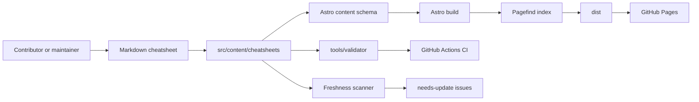
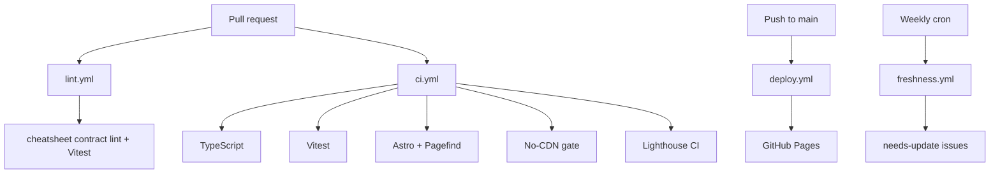

# Architecture

Awesome AI Cheatsheets has three connected parts:

1. a static Astro catalog site;
2. a TypeScript validator/toolchain for the cheatsheet contract;
3. GitHub Actions automation for CI, deployment, and freshness tracking.

## System overview



## Static site

Astro renders the public site from `src/pages/`, `src/layouts/`, and `src/components/`.

Key files:

| File | Role |
|---|---|
| `astro.config.mjs` | Astro integrations, GitHub Pages `site` and `base`, static output. |
| `src/pages/index.astro` | Catalog landing page. |
| `src/pages/cheatsheets/[slug]/index.astro` | Detail page for each cheatsheet. |
| `src/layouts/CheatsheetLayout.astro` | Shared cheatsheet page presentation. |
| `src/content/config.ts` | Content collection schema for frontmatter. |
| `src/plugins/remark-mermaid.ts` | Mermaid rendering support for diagrams. |

## Content model

Cheatsheets live at:

```text
src/content/cheatsheets/<slug>/<slug>.md
```

Frontmatter is validated by the Astro collection schema in `src/content/config.ts`. Required concepts include title, category, summary, freshness metadata, tags, status, and links.

The validator adds template-specific checks that go beyond frontmatter:

- required sections in locked order;
- one-liner presence;
- collapsed reference section;
- Mermaid syntax;
- optional external link probing.

## Validator and CLI

The validator entry point is `tools/validator/index.ts`.

The CLI wrapper is `tools/cli/lint.ts`, exposed as:

```bash
pnpm cheatsheet:lint <path-or-glob> [--no-links] [--format=human|json]
```

It returns:

- `0` when all files pass;
- `1` when at least one file fails validation;
- `2` for usage errors.

## Automation flow



## Freshness automation

`tools/ci/freshness-scan.ts` scans cheatsheets, computes staleness with `tools/utils/freshness.ts`, and opens deduplicated `needs-update` issues when entries pass their freshness budget.

The workflow runs every Monday at 09:00 UTC and can be triggered manually in dry-run mode.

## Security and privacy posture

- The built site is static.
- The no-CDN gate blocks baseline third-party CDN dependencies in `dist/`.
- Google Analytics is documented as consent-gated, not loaded by default.
- GitHub Actions use narrow permissions per workflow.
- Secrets are not required for local development.
