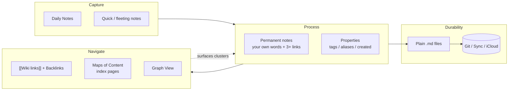

# Obsidian — Knowledge Vault Cheatsheet

**One-line:** Obsidian is a local-first note app built on plain Markdown files with bidirectional `[[wiki links]]`, a graph view, and a deep plugin ecosystem — the workflow that wins is *link liberally, fold sparingly, capture daily*.

**Who this is for:** Anyone setting up a personal knowledge vault — students, researchers, writers, developers — who wants to avoid the classic beginner trap of over-organizing folders before they have any notes worth organizing.

**Read time:** ~8 min · **Apply Steps 1–4:** under 30 min

## Mental Model



**Layers worth distinguishing:**
- **Links** = the connective tissue (prefer over folders)
- **Folders** = a few broad buckets only (e.g. `Daily`, `Attachments`)
- **MOCs** = curated index pages you write by hand
- **Properties / tags** = lightweight metadata for querying, kept consistent
- **Plain Markdown** = the durability guarantee — no vendor lock-in

## Installation

Obsidian is a desktop/mobile **application** (not a CLI). It is free for personal use, requires no account, and runs on Windows, macOS, Linux, iOS, and Android.

**Primary — download from the official site:**
- [obsidian.md/download](https://obsidian.md/download)

**Or via a package manager (desktop):**
```bash
# macOS (Homebrew)
brew install --cask obsidian

# Windows (winget)
winget install Obsidian.Obsidian

# Windows (Chocolatey)
choco install obsidian

# Linux (Flatpak, from Flathub)
flatpak install flathub md.obsidian.Obsidian
```
> Linux also ships an official AppImage, `.snap`, and `.deb` on the download page. Mobile installs come from the App Store / Google Play.

**First run — create your vault:**
1. Launch Obsidian → **Create new vault**.
2. Point it at an **empty local folder** (this folder *is* your vault — it holds plain `.md` files plus a `.obsidian/` config dir).
3. No sign-in needed. You can create unlimited vaults; start with **one**.

**Cross-device sync (pick one):**
- **Obsidian Sync** — official, paid, end-to-end encrypted.
- **Git** — free, versioned; best for text-heavy vaults (see Step 7).
- **iCloud / Dropbox / OneDrive** — free, simple; watch for conflict files on simultaneous edits.

## Step-by-Step Setup & Optimization

### Step 1 — Enable Core Plugins (5 min)

Open **Settings (⚙)** → **Core plugins** and turn on the essentials:

- **Daily Notes** — dated capture hub
- **Backlinks** — see incoming links automatically
- **Outgoing Links**
- **Graph View** — visualize connections
- **Templates** — standardize new notes
- **Quick Switcher** — `Ctrl/Cmd + O` to jump to any note
- **Search** & **Command Palette** (`Ctrl/Cmd + P`)
- **Canvas** — visual mind-mapping (optional)

> **Why:** Core plugins are first-party and zero-risk. Get value from them before reaching for community plugins.

### Step 2 — Set Conventions Before You Have Notes (5 min)

- **Settings → Files & Links:** set a default location for new notes (root or a `Notes` folder), and an **Attachments** folder for images/PDFs so media doesn't litter the root.
- **Settings → Appearance:** pick a theme. The built-in light/dark themes are fine to start; community themes can come later.
- Decide **naming conventions now**: lowercase tags (`#project`, not `#Project`), and a rule for singular vs. plural. Consistency makes search and tags actually work.

### Step 3 — Create a Home MOC + Daily Folder (5 min)

1. Create `Home MOC.md` (or `Home.md`) as your dashboard — a hand-maintained index page that links to your major MOCs and active projects.
2. Make a `Daily/` folder and point Daily Notes at it (**Settings → Daily Notes → New file location**).
3. Optionally set a **Daily Note template** (a `Templates/` folder + the Templates plugin) with your standard headings (e.g. `## Captured`, `## Tasks`, `## Log`).

### Step 4 — Learn the Core Loop: Link As You Write (10 min)

This is the single highest-leverage habit in Obsidian.

- New note: `Ctrl/Cmd + N`.
- Link inline: type `[[` to trigger the picker, then a note title. Linking to a note that doesn't exist yet creates it on click — that's intentional and good.
- Embed media/notes: `![[image.png]]` or `![[Other Note]]`.
- Tasks: `- [ ] do the thing`.
- Properties (YAML frontmatter at the top of a note) for metadata:
  ```yaml
  ---
  aliases: [alt-name]
  tags: [project, idea]
  created: 2026-05-29
  ---
  ```
- Open the **Backlinks** pane to see what links *in*. Open **Graph View** to see clusters.

> **Rule of thumb:** aim for **3+ links per new note**. If a note connects to nothing, it will be lost. Links beat folders for retrieval.

### Step 5 — Add 3–5 Community Plugins (only when you feel the need)

**Settings → Community plugins → Browse.** Don't install everything — add a plugin when a real friction appears.

Commonly recommended starters:
- **Dataview** — query your notes like a database (see Step 6).
- **Calendar** — visual daily-note navigation.
- **Templater** — more powerful templating than the core plugin.
- **Style Settings** — UI knobs for themes that support it.

> **Why minimal:** every plugin is third-party code with a startup and maintenance cost. More plugins = more breakage on Obsidian updates and slower launches.

### Step 6 — Dataview: Turn Notes Into Dynamic Lists (intermediate)

With the **Dataview** plugin enabled, embed a query in a fenced `dataview` block. Queries read the properties and `file.*` metadata across your vault.

List recent daily notes (uses `file.day`, the date Dataview infers from a note's filename):
````markdown
```dataview
LIST
WHERE file.day AND file.day <= date(today)
SORT file.day DESC
```
````

List open tasks across the vault:
````markdown
```dataview
TASK
WHERE !completed
```
````

> Dataview has its own query language (DQL) plus a JS API. Start with `LIST` and `TASK`; reach for `TABLE` and JS only when you need them.

### Step 7 — Back Up With Git (free, versioned)

Because the vault is plain text, Git is a natural fit.

```bash
cd /path/to/your/vault
git init
printf ".obsidian/workspace*\n.trash/\n" > .gitignore   # ignore volatile UI state
git add .
git commit -m "init vault"
```
Then push to a private remote and commit regularly (or use the community **Obsidian Git** plugin to automate periodic commits).

> **Why:** Git gives you history, rollback, and recovery for free — and Markdown means every backup is human-readable forever.

### Step 8 — Pick a Workflow & Iterate (ongoing)

Choose a light framework and adapt it — don't adopt it whole on day one:

- **PARA** — `Projects` (active), `Areas` (ongoing), `Resources` (reference), `Archive` (done).
- **Zettelkasten** — fleeting notes → literature notes → permanent atomic notes, each densely linked.
- **Source separation** — keep raw references (clippings, papers) in one place; process them into linked evergreen notes in your own words.

Review the **Graph weekly**, spot clusters, and promote recurring themes into new MOCs.

## Best Practices

### Do
- ✅ **Link liberally and early** — 3+ links per note; create links inline as you write.
- ✅ **Minimize folders** — lean on links, backlinks, MOCs, and properties instead.
- ✅ **Capture daily** — use Daily Notes as the inbox, then process into permanent notes.
- ✅ **Separate sources from your own notes** — references in one bucket, evergreen notes in another.
- ✅ **Keep naming consistent** — lowercase tags, aliases for alternate names, one plural/singular rule.
- ✅ **Start with one vault** — split only when you have a concrete reason (e.g. work vs. personal).
- ✅ **Back up from day one** — Git or Sync; plain Markdown makes recovery trivial.
- ✅ **Review the Graph weekly** and prune orphaned/unused tags and properties.

### Don't
- ❌ Build an elaborate folder hierarchy before you have notes — you'll reorganize it three times and lose the will.
- ❌ Install a pile of community plugins up front — add them only when a real friction appears.
- ❌ Let notes sit unlinked — an orphan note is a lost note.
- ❌ Chase perfection on capture — write boldly, refine later (the "gardener" approach).
- ❌ Edit simultaneously across devices on file-sync services without care — that's how you get conflict files.
- ❌ Over-tag — a sprawling tag list with one note each is noise, not structure.

### When to use Obsidian (vs. alternatives)
- **Use Obsidian when:** you want local-first, plain-Markdown ownership, dense linking, and a plugin ecosystem you control.
- **Use a hosted app (Notion, etc.) when:** you need real-time multi-user collaboration and databases more than file ownership.
- **Use a plain folder of Markdown + your editor when:** you don't need backlinks, graph, or plugins at all.

## Quick Command Reference

| Goal | Action |
|---|---|
| New note | `Ctrl/Cmd + N` |
| Quick switcher (jump to note) | `Ctrl/Cmd + O` |
| Command palette | `Ctrl/Cmd + P` |
| Internal link | type `[[` → pick/type a note title |
| Embed file / note | `![[image.png]]` · `![[Note Title]]` |
| Task checkbox | `- [ ] task` |
| Tag in note / search | `#tag` · `tag:#work` (search) |
| Open today's Daily Note | Command palette → *Daily notes: Open today's daily note* |
| Find orphaned files | Command palette → *Find orphaned files* |
| Open dev console (debug) | `Ctrl/Cmd + Shift + I` |
| Dataview list | ` ```dataview ` + `LIST WHERE ...` |
| Git backup | `git add . && git commit -m "..."` |

## Expected Outcomes (after Steps 1–4)

- **Low-friction capture:** ideas land in Daily Notes immediately; nothing waits on "where does this go?"
- **A growing graph:** because you link as you write, related notes surface themselves via backlinks and Graph View.
- **No lock-in:** every note is a plain `.md` file you can read, grep, version, and migrate anywhere.
- **Compounding value:** weeks in, MOCs and clusters emerge from your linking habit — the vault starts answering questions you didn't index for.
- **Recoverable by default:** with Git/Sync, a lost note or bad edit is a `git checkout` away.

## Reference

<details>
<summary>Sources & deeper reading</summary>

- **Official site & download:** [obsidian.md](https://obsidian.md/) · [obsidian.md/download](https://obsidian.md/download)
- **Help / docs:** [help.obsidian.md](https://help.obsidian.md/)
- **Community forum:** [forum.obsidian.md](https://forum.obsidian.md/)
- **Dataview plugin:** [blacksmithgu/obsidian-dataview](https://github.com/blacksmithgu/obsidian-dataview) · [DQL reference](https://blacksmithgu.github.io/obsidian-dataview/)
- **Templater plugin:** [SilentVoid13/Templater](https://github.com/SilentVoid13/Templater)
- **Obsidian Git plugin:** [Vinzent03/obsidian-git](https://github.com/Vinzent03/obsidian-git)
- **Methodologies:** PARA (Tiago Forte) · Zettelkasten (Niklas Luhmann) — see the community forum and Help docs for Obsidian-specific guides.

> Best-practice steps in this sheet synthesize recurring community guidance (linking over folders, minimalism, progressive setup) from the Obsidian forum, Reddit, and Medium guides. Plugin/version specifics should be re-verified against current docs before relying on them.

</details>
