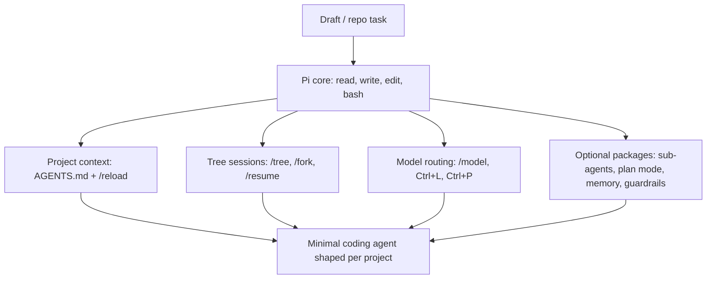

# Pi — Minimal Coding Agent Cheatsheet

**One-line:** Pi (pi.dev) is a minimal, extensible terminal-based AI coding agent harness — 4 baseline tools, tree-structured sessions, 15+ LLM providers, and packages/skills/extensions for anything beyond the core.

**Who this is for:** Developers who want a CLI coding agent without baked-in opinions — start with `read / write / edit / bash`, then add only the sub-agents, plan mode, memory, or guardrails you actually need.

**Read time:** ~6 min · **Apply Steps 1–3:** under 20 min

## Installation

Node.js 20+ required (works with npm/pnpm/bun/yarn). Runs on macOS, Linux, and Windows; Termux is supported. `tmux` is recommended for long sessions.

**Official one-liner (auto-detects platform):**
```bash
curl -fsSL https://pi.dev/install.sh | sh
```

**Or via npm (any package manager):**
```bash
npm install -g @earendil-works/pi-coding-agent
```

**Uninstall:**
```bash
npm uninstall -g @earendil-works/pi-coding-agent
```

**First run — launch from a project and authenticate:**
```bash
cd /path/to/your/project
pi                              # launch the TUI
/login                          # OAuth for Claude / ChatGPT / Copilot subscriptions
```

Or set provider env vars before launching:
```bash
export ANTHROPIC_API_KEY=sk-ant-...
pi
```

Keys live at `~/.pi/agent/auth.json`.

> **Why a one-liner?** It pins the upstream-published version and avoids unofficial channels (Pi does not publish a Homebrew formula — install only from `pi.dev` or the official npm package).

## Mental Model



Pi starts intentionally small: first make the four core tools useful in your repository, then branch sessions, switch models, and install packages only when the workflow repeats.

## Step-by-Step Setup & Optimization

### Step 1 — First session: prompt, default tools, shell escapes

Once `pi` is launched in your project:

```text
> Summarize this repo
```

Default tools: `read`, `write`, `edit`, `bash` (plus `grep`, `find`, `ls`).

Shell escapes from the prompt:

| Syntax | Behavior |
|---|---|
| `!command` | Run a shell command; output is returned to the model |
| `!!command` | Run a shell command; output is **not** added to context |

> **Why:** The 4 baseline tools are intentionally minimal. Avoid loading extensions until you hit a wall — Pi's design assumes you only add what you need.

### Step 2 — Add project context with `AGENTS.md`

Create `AGENTS.md` in your project root (or `~/.pi/agent/` for global defaults) with project-specific instructions: stack, conventions, "run checks after edits", etc. Pi walks from the current directory up through parent dirs and loads what it finds.

After editing, reload without restarting:

```text
/reload
```

> **Why:** Per-project context replaces re-explaining the stack on every session. Keep it small — Pi loads it on every turn.

### Step 3 — Reference files, paste images, switch models

**Reference files in a prompt:**
```text
> @src/server.ts @README.md  refactor the request handler
```

Or pass them on the command line:
```bash
pi @file1 @file2 "task"
```

**Paste images** with `Ctrl+V` (Pi supports vision-capable models).

**Switch model / provider:**

| Shortcut | What it does |
|---|---|
| `/model` | Open the model picker |
| `Ctrl+L` | Quick model switch |
| `Ctrl+P` | Provider switch |

Custom providers go in `models.json`; pair with Ollama or LM Studio for local-only runs.

### Step 4 — Tree sessions: continue, fork, resume

Pi sessions are tree-structured — every prompt is a node you can branch from.

```bash
pi -c                # continue the last session
```

In-chat:

| Command | Behavior |
|---|---|
| `/tree` | Show the session tree |
| `/fork` | Branch from the current node |
| `/new` | Start a fresh root |
| `/resume` | Pick a node to resume from |
| `/export` | Export the session (local file) |
| `/share` | Publish to a GitHub gist |

> **Why:** Forking is cheaper than re-prompting. When you're about to try a risky refactor, fork first.

### Step 5 — Extensions, packages, and skills

Everything beyond the 4 baseline tools is a package. Browse [pi.dev/packages](https://pi.dev/packages).

```bash
pi install npm:<package>
pi install git:<repo>
```

Common adds:
- **sub-agents** — Pi does not ship sub-agents in the core; install a package if you want them
- **plan mode** — same: an extension, not a core feature
- **web access** — fetch URLs / search
- **memory** — persistent recall across sessions
- **guardrails** — input/output checks

Skills are Markdown files you author yourself — drop them under `~/.pi/skills/<name>/` (or wherever the docs specify) and invoke with `/name`. Ask Pi: *"create a skill for this workflow"* after you've done the workflow once.

> **Rule of thumb:** add the extension on the **second** repeat of a task, not the third.

### Step 6 — Customize, advanced modes, hotkeys

**Customize the system prompt, prompt templates, and themes** — all are Markdown files Pi loads from its config dirs. After editing: `/reload`.

**Run modes:**

| Mode | Invocation |
|---|---|
| Interactive (default) | `pi` |
| Headless prompt | `pi -p "your prompt"` |
| JSON output | `pi --mode json` |
| RPC / SDK | see docs |

**Steering mid-run:**

| Key | Action |
|---|---|
| `Enter` | Steer the agent mid-run (interrupt and add direction) |
| `Alt+Enter` | Send a follow-up without interrupting |
| `Ctrl+L` | Switch model |
| `Shift+Tab` | Toggle thinking level |

## Best Practices

### Do
- ✅ Start with the 4 baseline tools — only add extensions on the **second** time you hit the same wall.
- ✅ Put project-specific rules in `AGENTS.md`; use `/reload` after editing.
- ✅ Fork the session (`/fork`) before risky changes; tree sessions are cheaper than re-prompting.
- ✅ Run inside `tmux` for long-running sessions and inside Docker/containers for anything that touches the network or untrusted code.
- ✅ Pair with Ollama or LM Studio for local, free runs on smaller models.
- ✅ Use git commits or filesystem checkpoints between agent turns so you can roll back.
- ✅ Review every diff before accepting — Pi will happily edit files you didn't expect.

### Don't
- ❌ Install Pi from unofficial channels (e.g., a third-party Homebrew tap) — only `pi.dev/install.sh` or the official `@earendil-works/pi-coding-agent` npm package.
- ❌ Load every package in `pi.dev/packages` on day one — extension sprawl is the #1 way to lose the minimalism advantage.
- ❌ Run with frontier models for trivial lookups — Pi supports 15+ providers; route cheap models for cheap tasks.
- ❌ Trust agent output blindly — review diffs, especially when sub-agents or plan mode extensions are in play.
- ❌ Edit core config (`models.json`, `AGENTS.md`) mid-turn — Pi reloads at session boundaries, not mid-prompt.

### When to use Pi (vs alternatives)
- **Use Pi when:** You want a *minimal* coding agent CLI you can shape — start tiny, add only what you need, BYO model.
- **Use a richer-default CLI** (Claude Code / Codex / OpenCode) **when:** You want sub-agents, plan mode, or memory working out of the box without picking and installing packages.
- **Use Hermes Agent when:** You want a *persistent, cross-channel* agent (Telegram/Slack, long-horizon memory, Kanban) rather than an in-repo coding-first CLI.

## Quick Command Reference

| Goal | Command |
|---|---|
| Install | `curl -fsSL https://pi.dev/install.sh \| sh` |
| Install (npm) | `npm install -g @earendil-works/pi-coding-agent` |
| Uninstall | `npm uninstall -g @earendil-works/pi-coding-agent` |
| Launch in project | `cd <project> && pi` |
| Authenticate (subscription) | `/login` |
| Continue last session | `pi -c` |
| Headless prompt | `pi -p "your prompt"` |
| JSON output mode | `pi --mode json` |
| Reference a file in prompt | `@filename` or `pi @file1 @file2 "task"` |
| Reload project context | `/reload` |
| Model picker | `/model` (or `Ctrl+L`) |
| Provider switch | `Ctrl+P` |
| Toggle thinking level | `Shift+Tab` |
| Session tree | `/tree` |
| Fork session | `/fork` |
| New root session | `/new` |
| Resume a node | `/resume` |
| Export session | `/export` |
| Share as gist | `/share` |
| Install a package | `pi install npm:<pkg>` or `pi install git:<repo>` |
| Run shell (output to model) | `!command` |
| Run shell (silent) | `!!command` |
| Paste image | `Ctrl+V` |

## Expected Outcomes (after Steps 1–3)

- **Working Pi install:** `pi` launches from your project root and authenticates via `/login` or env-var keys.
- **Project context loaded:** `AGENTS.md` is picked up automatically; `/reload` applies edits without restart.
- **Multi-provider routing:** `/model` swaps between Anthropic / OpenAI / OpenRouter / Ollama in one keystroke.
- **Tree sessions:** `/fork` and `pi -c` replace destructive re-prompting; you can branch from any past turn.
- **Minimal footprint:** 4 default tools + only the packages you've explicitly installed — no surprise behaviour from features you didn't opt into.

## Reference

<details>
<summary>Sources & deeper reading</summary>

- **Homepage:** [pi.dev](https://pi.dev/)
- **Official docs:** [pi.dev/docs](https://pi.dev/docs)
- **Packages catalog:** [pi.dev/packages](https://pi.dev/packages)
- **npm package:** `@earendil-works/pi-coding-agent` — install with `npm install -g @earendil-works/pi-coding-agent` (the npmjs.com page is reachable in a browser; some link-checkers see Cloudflare's bot challenge, so we keep the package name here without the URL).
- **See also:** [Hermes Agent cheatsheet](/cheatsheets/hermes-agent/) — persistent, cross-channel agent for when Pi's coding-CLI scope is too narrow.

</details>
