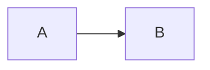

# Example Tool — Cheatsheet

**One-line:** A cheatsheet with no YAML frontmatter, used to exercise the frontmatter-missing rule.

## Mental Model



## Step-by-Step Setup & Optimization

### Step 1 — Install

```bash
example install
```

## Best Practices

- Do this

## Quick Command Reference

| Goal | Command |
|---|---|
| Install | `example install` |

## Expected Outcomes

- A working setup

## Reference

<details>
<summary>Sources</summary>

- https://example.com/

</details>
