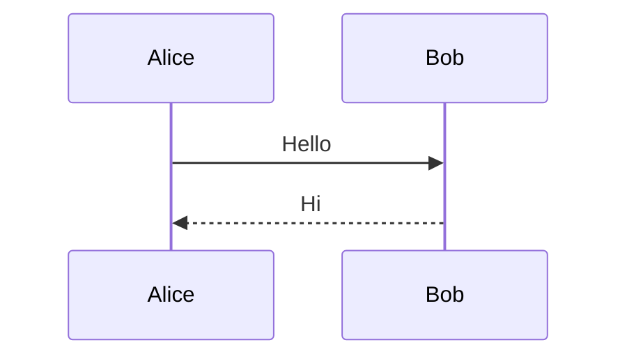
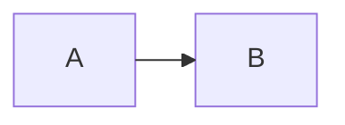

# Nonbundled Mermaid Fixture

**One-line:** Carries a well-formed sequenceDiagram fence so the bundled-engine rule rejects a type the client build trims.

## Installation

```bash
curl -fsSL https://example.com/install.sh | bash
```

## Step-by-Step Setup & Optimization

### Step 1 — Install

```bash
example install
```

## Best Practices

- Do this

## Quick Command Reference

| Goal | Command |
|---|---|
| Install | `example install` |

## Expected Outcomes

- A working setup

## Reference

<details>
<summary>Sources</summary>

- https://example.com/

</details>

## Extra Diagram




